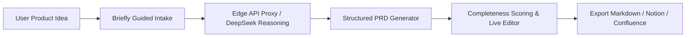

# 📝 Briefly — AI Product Requirements Document (PRD) Workspace

<p align="center">
  <strong>Transform rough product concepts into comprehensive, decision-ready PRDs in seconds using DeepSeek & Next.js.</strong>
</p>

<p align="center">
  <a href="https://portfolio.madanmohanlearning.workers.dev/"></a>
  <a href="#license"></a>
  <a href="https://nextjs.org"></a>
  <a href="https://react.dev"></a>
  <a href="https://deepseek.com"></a>
  <a href="https://workers.cloudflare.com"></a>
</p>

---

## 📌 Overview

**Briefly** is an AI-powered product management workspace designed to eliminate the blank-page problem for Product Managers, Technical Program Managers, and Engineering Leads. By combining structured contextual intake with DeepSeek's advanced reasoning models, Briefly transforms loose product ideas into structured, actionable Product Requirements Documents (PRDs) complete with user personas, user stories, acceptance criteria, technical considerations, and success metrics.

---

## ✨ Key Features

- **🧠 Guided Contextual Intake:** Multi-step questionnaire capturing core problem statements, target personas, technical constraints, and business goals.
- **⚡ DeepSeek AI Synthesis:** Generates complete, structured PRD sections:
  - **Executive Summary & Problem Statement**
  - **Target User Personas & Pain Points**
  - **Functional Requirements & User Stories** (with testable acceptance criteria)
  - **Non-Functional Requirements** (Performance, Security, Compliance)
  - **Technical Architecture & Data Model Considerations**
  - **KPIs, Success Metrics & GTM Rollout Checklist**
- **✏️ Real-Time Document Completeness Scoring:** Live quality score evaluates the thoroughness of the PRD draft as you refine it.
- **💾 Local-First Drafts & Multi-Format Export:** Automatic local-storage draft saving with instant export to **Markdown (.md)**, **HTML**, and **Clipboard**.
- **🛡️ Privacy & Rate Limiting:** Server-side DeepSeek key protection with privacy-preserving SHA-256 hashed rate limiting via **Upstash Redis**.
- **🌐 Serverless & Edge Deployed:** Deployed as a full-stack Next.js application on **Cloudflare Workers** with zero cold starts.

---

## 🏗️ Architecture



---

## 🚀 Quick Start

### Prerequisites
- **Node.js:** v20+ or v22+
- **pnpm:** `npm install -g pnpm`
- **DeepSeek API Key**
- **Upstash Redis REST URL & Token** (for rate limiting)

### Installation

```bash
# Clone the repository
git clone https://github.com/MadanMohan0537/briefly-prd-ai.git
cd briefly-prd-ai

# Install dependencies
pnpm install

# Configure environment variables
cp .env.example .env.local
# Fill in DEEPSEEK_API_KEY, UPSTASH_REDIS_REST_URL, UPSTASH_REDIS_REST_TOKEN in .env.local

# Run development server
pnpm dev
```

Open [http://localhost:3000](http://localhost:3000) in your browser.

---

## 🛠️ Tech Stack

- **Framework:** Next.js (App Router), React
- **Language:** TypeScript
- **AI Model:** DeepSeek-V3 / DeepSeek-R1 API
- **State & Storage:** Local-first browser storage + Upstash Redis
- **Styling:** Vanilla CSS & PostCSS
- **Deployment:** Cloudflare Workers (Vinext / OpenNext)

---

## 📄 License

MIT License — see [LICENSE](LICENSE) for details.
